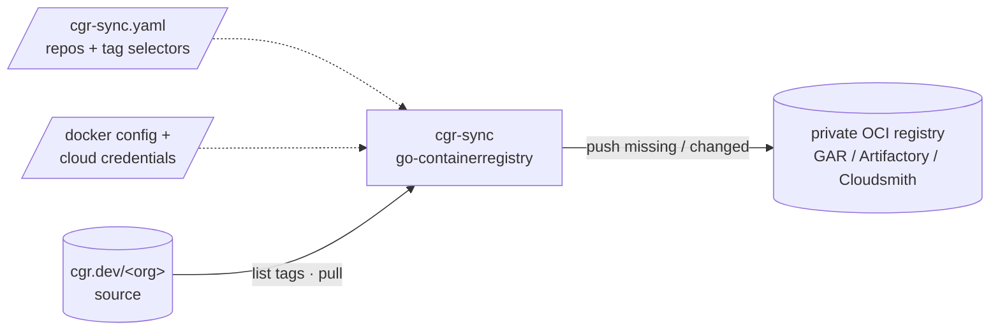
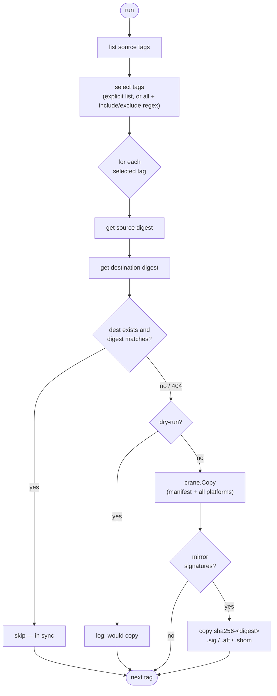
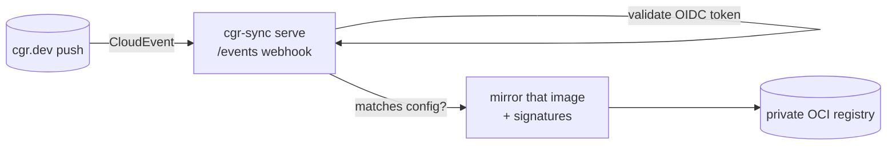

# cgr-sync

A one-shot CLI that mirrors [Chainguard](https://www.chainguard.dev/) images
from `cgr.dev` into a **private OCI registry** — Google Artifact Registry,
JFrog Artifactory, Cloudsmith, or any registry that speaks the OCI distribution
API. Built to run as a CI/CD step: read a config, copy what's missing, exit with
a status code.

- **Diff-based & idempotent** — lists source tags, compares digests against the
  destination, and copies only what's missing or changed. Re-running is cheap.
- **Multi-arch aware** — copies image indexes whole (all platforms) via
  [`go-containerregistry`](https://github.com/google/go-containerregistry).
- **Supply-chain preserving** — also mirrors cosign signatures, attestations,
  and SBOMs (the `sha256-<digest>.sig`/`.att`/`.sbom` tag scheme), so the mirror
  stays verifiable.
- **Verify before mirror** — optionally gate copying on a cosign policy
  (certificate identity + OIDC issuer), so only verified images are mirrored.
- **Any OCI registry** — auth comes from the standard Docker keychain
  (`~/.docker/config.json`), ambient cloud credentials, and cred helpers; no
  per-vendor code required.

## How it works

At a high level, cgr-sync reads a config, pulls from the Chainguard source, and
pushes only what's missing to your private registry:



For each repository it lists the source tags, selects the ones you asked for,
and diffs each by digest — copying only what the destination is missing or has
stale, then mirroring that image's cosign artifacts:



## Install / build

```sh
go build -o cgr-sync ./cmd/cgr-sync
```

## Usage

Two modes — a one-shot `sync` (run on a schedule / in CI) and a `serve`
listener that mirrors in near-real-time on Chainguard push events. They're
complementary: `serve` reacts immediately to new images; the scheduled `sync`
reconciles anything a missed event would have left behind.

```sh
cgr-sync sync  -config cgr-sync.yaml             # one-shot mirror (default subcommand)
cgr-sync sync  -config cgr-sync.yaml -dry-run    # plan only, copy nothing
cgr-sync serve -config cgr-sync.yaml -audience https://mirror.example.com/events
```

`sync` flags:

| Flag | Default | Meaning |
|---|---|---|
| `-config` | `cgr-sync.yaml` | Path to the config file. |
| `-dry-run` | `false` | Plan and print the work; copy nothing. |
| `-continue-on-error` | `false` | Keep going after a failure instead of exiting on the first. |
| `-no-signatures` | `false` | Mirror images only; skip cosign artifacts. |

Exit code is `0` on success, `1` if any image failed, `2` on a config error.
(`cgr-sync` with no subcommand defaults to `sync`; `cgr-sync -version` prints the version.)

## Event-driven mode (Chainguard CloudEvents)

`cgr-sync serve` runs an HTTP webhook that listens for Chainguard
[registry events](https://edu.chainguard.dev/chainguard/administration/cloudevents/events-example/).
On a `push` event (`dev.chainguard.registry.push.v1`) it validates the event's
OIDC token, then mirrors that single image — but only if the repository is in
your config and the tag passes its selector. Other event types and
unconfigured repos are acknowledged and ignored.



Run the listener (it needs a public URL, e.g. behind an Ingress / Cloud Run):

```sh
cgr-sync serve \
  -config cgr-sync.yaml \
  -addr :8080 \
  -audience https://mirror.example.com/events \   # your public webhook URL (token audience)
  -identity webhook:<your-UIDP>                    # optional: pin the event subject
```

Then subscribe it to your organization's events:

```sh
chainctl events subscriptions create https://mirror.example.com/events
```

`serve` flags:

| Flag | Default | Meaning |
|---|---|---|
| `-config` | `cgr-sync.yaml` | Path to the config file. |
| `-addr` | `:8080` | Listen address. |
| `-path` | `/events` | Webhook path. |
| `-audience` | | Expected token audience = your public webhook URL. Required unless `-insecure-skip-verify`. |
| `-identity` | | Expected event subject, e.g. `webhook:<UIDP>` (optional extra check). |
| `-no-signatures` | `false` | Mirror images only; skip cosign artifacts. |
| `-insecure-skip-verify` | `false` | **Local testing only** — skip token validation. Never expose publicly. |

Tokens are verified against the Chainguard issuer `https://issuer.enforce.dev`
(signature, expiry, issuer, audience, and — if set — subject). `GET /healthz`
returns `ok` for liveness probes.

## Configuration

See [`examples/cgr-sync.yaml`](examples/cgr-sync.yaml). Per-repo settings inherit
from `defaults`:

```yaml
defaults:
  source: cgr.dev/example.com
  destination: us-docker.pkg.dev/my-project/cgr-mirror
  tags:
    list: ["latest"]

repositories:
  - name: python
    tags:
      list: ["latest", "3.12", "3.13"]
  - name: node
    tags:
      all: true
      include: '^[0-9]+$'    # major-version tags only
      exclude: '-dev$'
  - name: nginx
    destination: cloudsmith.io/my-org/cgr-mirror/nginx   # per-repo override
    tags: { list: ["latest"] }
```

A repository's `destination` may be a registry+namespace prefix (the repo name
is appended) or a full repository path (used as-is). `${VAR}` anywhere in the
config is expanded from the environment (a bare `$`, e.g. in a regex like
`-dev$`, is left alone), so registries/secrets can come from CI variables.

## Verification (cosign)

Set a `verify` policy to gate mirroring on signature verification — an image is
copied only if its cosign signature satisfies the policy, so you never mirror an
unverified or tampered image. It maps onto `cosign verify` and requires the
`cosign` binary on `PATH`.

```yaml
defaults:
  verify:
    enabled: true
    certificate_identity: https://github.com/chainguard-images/images-private/.github/workflows/release.yaml@refs/heads/main
    certificate_oidc_issuer: https://token.actions.githubusercontent.com
    # ...or the regex forms: certificate_identity_regexp / certificate_oidc_issuer_regexp
```

Verification runs against the exact **digest** about to be mirrored (not the tag,
avoiding a tag-vs-content race). Like `tags`, a `verify` block is inherited
whole from `defaults` unless a repository specifies its own. `enabled: true`
requires an identity (exact or regex) and an issuer (exact or regex).

## Authentication

cgr-sync uses your existing registry credentials — log in with each registry's
normal tooling before running:

- **Source (`cgr.dev`):** `chainctl auth login` (interactive) or, for CI, a
  non-interactive identity/pull token written into the Docker config. Avoid the
  interactive browser flow in pipelines.
- **Google Artifact Registry:** ambient credentials (workload identity / service
  account) are picked up automatically, or `gcloud auth configure-docker`.
- **Artifactory / Cloudsmith / other:** `docker login <registry>` (token/API
  key), which cgr-sync reads from `~/.docker/config.json`.

## CI/CD

Run it as a job step. Sketch (GitLab CI):

```yaml
mirror-images:
  image: golang:1.26
  script:
    - go build -o cgr-sync ./cmd/cgr-sync
    - ./cgr-sync -config cgr-sync.yaml -continue-on-error
```

Provide non-interactive credentials via the job environment / Docker config so
no browser login is triggered.

## Status / roadmap

MVP — generic OCI mirroring with signature/attestation copy, cosign
verify-before-mirror, and event-driven mirroring via Chainguard CloudEvents.
Planned next: referrers-API artifact mirroring, semver tag selection,
concurrency, and per-vendor auth conveniences.
